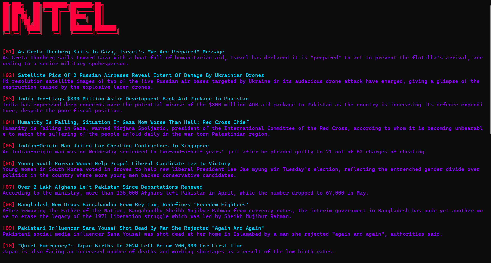

# OSINT-tools
## 🧪 Deploy Protocol 
git clone https://github.com/YOUR_USERNAME/OSINT-tools.git
pip install -r requirements.txt
# 🕶️ intel.py | ⚡ Terminal-Based News Recon Tool

> “In the age of data overload, *clarity is power*. 
> OSINT-tools put **real-time intel** in your hands, where it belongs — the command line.”

---
**intel.py** is a minimalist, terminal-based Open Source Intelligence (OSINT) tool designed to scrape news headlines and summaries from [NDTV.com](https://www.ndtv.com/), giving strategists, developers, and cyberpunk analysts a fast, readable format directly in the shell.

📛 Legal & Content Attribution
🧾 All news content and headlines scraped by intel.py are property of NDTV.com.
This tool is for educational, personal, and non-commercial research purposes only.
Please review and comply with NDTV's terms of use if adapting or expanding this codebase.

Boot up your terminal and intercept the data streams.
Welcome to the grid, Operator.

---

## 🧠 Tactical Arsenal

- 🔎 Real-time news scraping from NDTV India & global sections
- 🌏 Targeted geographic categories (Asia, Europe, Americas, etc.)
- 🧬 Specialized verticals: Science, Environment, Diaspora, Auto
- 🏙️ City-based trace mode: enter any Indian city and retrieve top headlines
- 🎨 Cyberpunk terminal UI with vibrant ANSI colors and ASCII banners
- 💀 Handles broken links and DOM mutations with custom error prompts

---

## 🛠️ Tech Stack

- **Python 3.8+**
- `requests`
- `BeautifulSoup4`
- `pyfiglet`
- `os`, `ANSI escape codes` for styling

---
## 💻 Visuals:

## 🧪 Deploy by running
python intel.py